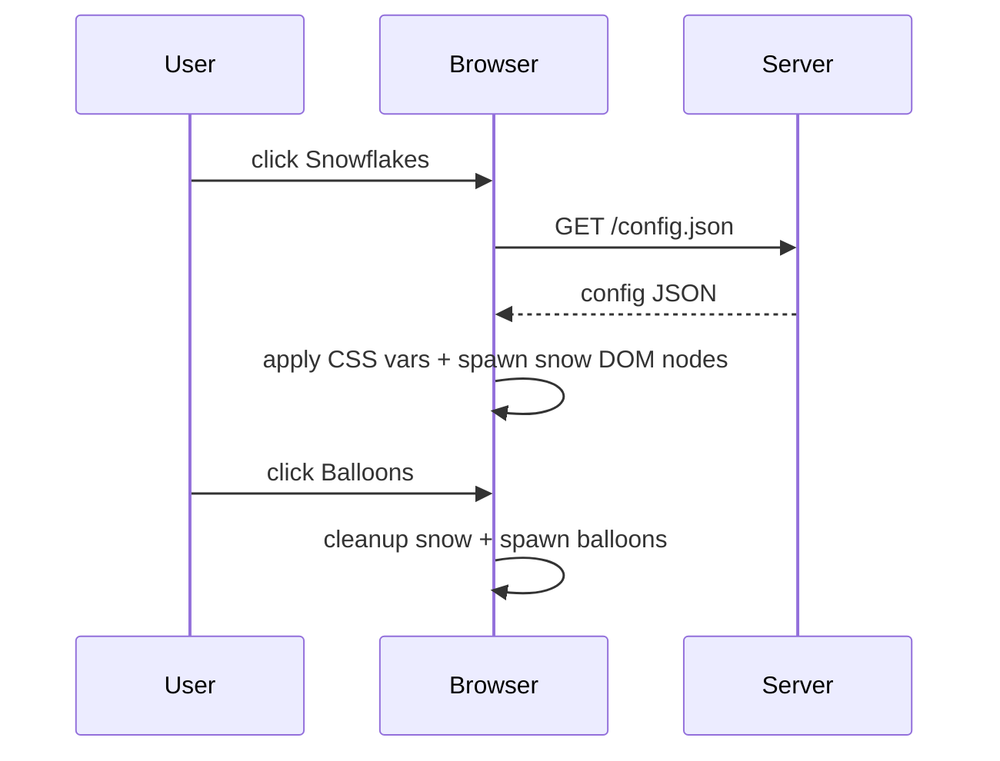

# Interactive Animation Page Design

## Overview
The page exposes two accessible buttons, _Snowflakes_ and _Balloons_, grouped above an animation canvas where clicking a button spawns the corresponding effect—falling snow or floating balloons—without navigating away, meeting the single-page experience requirement.

## Technical Stack
- **Entry point:** `public/index.html` with semantic markup for buttons and animation container.
- **Behavior:** Vanilla ES Modules in `public/scripts/animation.js` drive the DOM and CSS custom-property animations, avoiding new frameworks and honoring the preference for existing browser APIs [S4].
- **Styling:** CSS custom properties in `public/styles/main.css` encode theme defaults and animation timing, letting JavaScript and future environment overrides adjust via CSS variables [S3].
- **Configuration:** A Node-based generator script (`scripts/generate-config.mjs`) reads environment variables, emits `public/config.json`, and keeps all configuration environment-driven with safe defaults so no source edits are required to change color/animation timing [S3].

## Component Breakdown
1. **Button Group:** A semantic `<section>` with two `<button>` elements that have `aria-label`s, keyboard focus styles, and strong contrast colors defined via CSS variables.
2. **Animation Viewport:** A `div` with `aria-live="polite"` where animation layers (snowflake/balloon DOM nodes) are inserted and managed.
3. **Snowflake Effect Manager:** JS module that creates layered snowflake elements, animates them using CSS keyframes, and tears down prior animation polarities when switching effects.
4. **Balloon Effect Manager:** JS module that spawns balloons that float upward via CSS animations, with looped generation controlled by `requestAnimationFrame` and cleaned up when the other effect is selected.
5. **Config Fetch / Manager:** Runtime module (`public/scripts/config.js`) that fetches `config.json` produced by the generator script, applies color/animation-duration overrides, and exposes them to the animation controllers.
6. **Static Server (/config endpoint):** A minimal Node server in `server/index.js` serves static assets and `config.json`, ensuring the front-end can fetch environment-driven settings without embedding sensitive data in source.

## Configuration & API Contract
- **Configuration Source:** `scripts/generate-config.mjs` reads environment variables (e.g., `SNOW_COLOR`, `BALLON_ANIMATION_DURATION`) with sensible defaults and writes them to `public/config.json` before each build/deploy, satisfying the environment-driven configuration standard [S3].
- **Runtime Contract:** The browser fetches `/config.json`, expecting `{ "snowColor": "#fff", "snowDuration": 12000, "balloonColor": "#e23", "balloonDuration": 10000 }`. Handlers use these values for CSS variables and animation timing.
- **No External Code Execution:** All scripts are locally served; the config endpoint restricts responses to pre-structured JSON to prevent arbitrary evaluation [S3].

## Sequence Diagram (Optional)


## Implementation Sub-tasks [S1]
1. **animation-ui** (Label: `button-controls`, Estimate: 3): Build the semantic button group, animation canvas, and focus/contrast styles, wiring button clicks to a centralized controller [S1].
2. **snow-animation** (Label: `snowfall-layer`, Estimate: 5): Implement the snowflake generation/animation module with layered CSS keyframes and graceful teardown when effects switch [S1].
3. **balloon-animation** (Label: `balloon-layer`, Estimate: 5): Implement the balloon float module that continuously releases balloons, loops the motion, and responds to effect toggling [S1].
4. **config-integration** (Label: `env-config`, Estimate: 2): Create the env-driven generator script and runtime fetch logic to manage color and timing overrides from `config.json`, ensuring no hard-coded values and aligning with environment-driven configuration [S3].
5. **testing-and-accessibility** (Label: `accessibility-tests`, Estimate: 3): Add manual verification guidance or a lightweight automation script to confirm button actions toggle effects cleanly, and ensure `aria-live` updates and labels work as intended [S1].

## Story Metadata [S2]
- **Labels:** `button-controls`, `snowfall-layer`, `balloon-layer`, `env-config`, `accessibility-tests` (all lowercase, hyphenated) [S2].
- **Estimates:** Provided as Fibonacci-like values (3, 5, 5, 2, 3) per sub-task for planning clarity [S2].

## Project structure
```
/ (repo root)
├── design.md
├── README.md
├── package.json                # scripts: build-config, start, test
├── .env.example               # documents SNOW_COLOR, BALLOON_COLOR, etc.
├── server/
│   └── index.js               # lightweight HTTP server serving public/ and config.json
├── scripts/
│   └── generate-config.mjs    # reads env vars, writes public/config.json with defaults -> env-driven config [S3]
├── public/
│   ├── index.html             # semantic markup with buttons, animation viewport, script/style links
│   ├── styles/
│   │   └── main.css           # CSS vars for colors/timing, button styles, animation keyframes
│   └── scripts/
│       ├── animation.js       # controller wiring buttons, toggling snow vs balloon, cleanup
│       ├── config.js          # fetches /config.json and exposes runtime overrides
│       ├── snow.js            # snowflake DOM creation + animation logic
│       └── balloon.js         # balloon generation + animation logic
├── public/config.json         # generated config file with environment-defaulted values
└── tests/
    └── config.test.js         # node script ensuring config values are present/prevent regressions
```

This layout keeps entry points, styles, scripts, and tests organized so developers can quickly locate assets, while the server and config scripts ensure environment-safe configuration is centralized [S3].